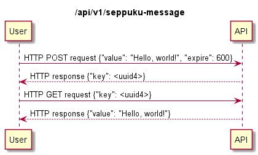

# Introduction

`seppuku-message` API is used for writing and reading self-destructing messages with optional auto-expire timers. 

# Overview

Endpoint `/api/v1/seppuku-message` implements the following methods:

* `POST`: User sends `value` and receives `key`
    * (optional) `expire` argument sets an auto-expiry timer in seconds
* `GET`: User sends `key` and receives `value`

Sending a `POST` request to `/api/v1/seppuku-message` with `value` argument returns a response with a random-generated UUID4 `key`. 
Optional `expire` argument is used to define an auto-expiry timer for the message. 
`GET` request with `key` argument will return a response containing the message `value`. The message is be deleted once read.

# Authentication

No authentication implemented.

# Error Codes

* 400: Invalid or no `value` in POST request
* 400: Invalid or no `key` in GET request

# Rate limit

No rate limit implemented.

# Usage

Send message "foo":

    curl -X POST https://localhost:443/api/v1/seppuku-message -d '{"value": "foo"}'